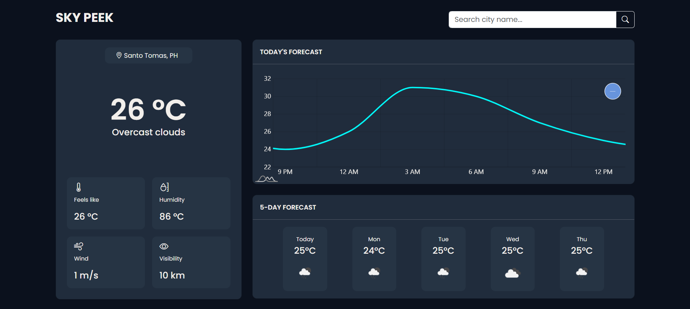

# 🌤️ SkyPeek – Weather Forecast Web App

> **SkyPeek** is a sleek, responsive weather forecast web application that allows users to search weather by city or get real-time weather updates using their **current location**. It provides **today's hourly forecast** and a **5-day forecast** using the OpenWeather API.



---

## ✨ Features

- 🔍 **Search Weather by City** – Get instant weather updates for any location worldwide.
- 📍 **Current Location Weather** – Uses geolocation to fetch weather data where you are.
- ⏳ **Today's Hourly Forecast** – Detailed temperature and condition updates hour-by-hour.
- 📅 **5-Day Forecast** – Plan ahead with upcoming weather predictions.
- 🌡️ **Temperature, Humidity, Wind Speed & Conditions** – All essential weather metrics.
- 📱 **Responsive Design** – Works beautifully on desktop and mobile devices.

---

## 🛠️ Tech Stack & Tools


---

## ⚙️ Installation

1. **Clone the repository**

   ```bash
   git clone https://github.com/your-username/skypeek.git
   cd skypeek

   ```

2. **Navigate to the project folder**
   ```bash
   cd skypeek
   ```

## 📂 Project Structure

```skypeek/
│── assets/
│   ├── css/
│   ├── js/
│   ├── images/
│── index.html
│── README.md
```

## 👨‍💻 Author

[](mailto:atienzajennamiles@gmail.com)  
[](https://binibiningjenna.github.io/)  
[](https://github.com/binibiningjenna)
